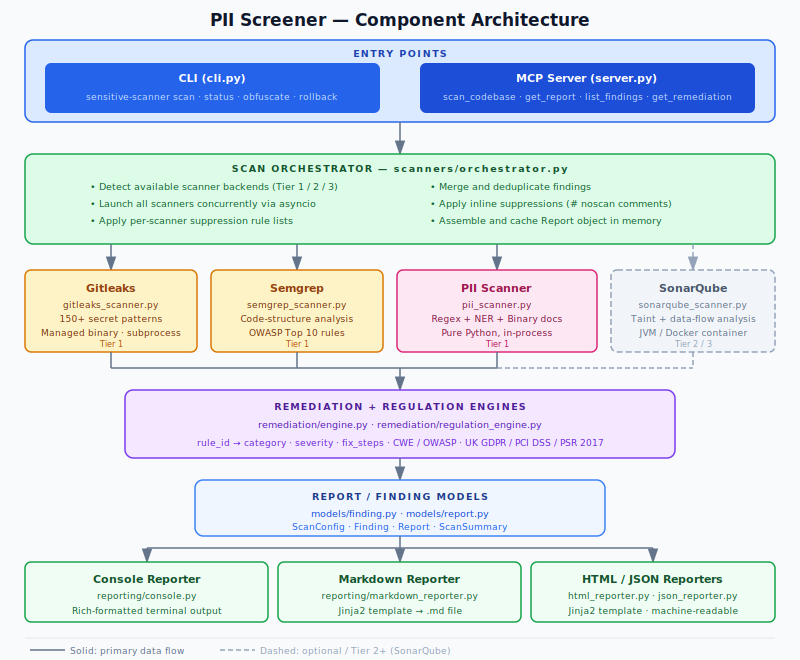
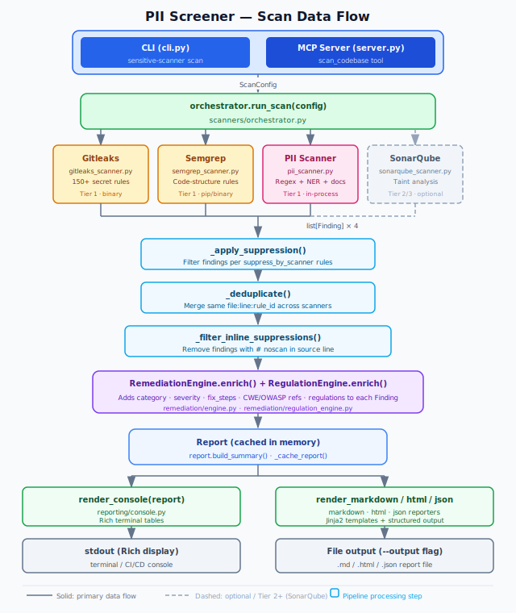

# PII Screener — High-Level Design Document

**Version:** 0.1  
**Status:** Current  
**Scope:** Architecture, component responsibilities, data flows, and extension points

---

## 1. Purpose and Problem Statement

Source code repositories routinely accumulate sensitive data in the wrong places — configuration files, test fixtures, hardcoded credentials, seed data, and comments. This creates two distinct risk categories:

- **Secrets exposure** — API keys, passwords, and tokens that grant access to live systems. Once committed to Git they are permanently retrievable from history even after deletion.
- **PII in code** — Real email addresses, phone numbers, names, and financial data embedded as test values or hardcoded constants. This creates GDPR Article 5 compliance obligations and potential Article 83 penalties.

PII Screener addresses both risk categories through a unified pipeline: it orchestrates multiple specialised scanning engines in parallel, merges and deduplicates their results, maps every finding to a regulation and remediation guide, and optionally redacts sensitive values directly in the source files.

---

## 2. Entry Points

The system exposes two independent entry points sharing the same core scanning pipeline:

| Entry Point | File | Purpose |
|---|---|---|
| **CLI** | `cli.py` | Interactive use, CI/CD pipelines, scripted scans |
| **MCP Server** | `server.py` | VS Code Copilot Chat integration via the Model Context Protocol |

Both entry points create a `ScanConfig`, call `orchestrator.run_scan()`, and receive a `Report` object. Neither contains scanning logic.

---

## 3. High-Level Architecture



---

## 4. Component Descriptions

### 4.1 Scan Orchestrator (`scanners/orchestrator.py`)

The central coordinator. Its `run_scan(config: ScanConfig)` function:

1. Calls `detect_available_scanners()` to determine which scanner backends are reachable and assigns a **tier** (1 = native binary, 2 = container, 3 = SonarCloud API).
2. Launches all requested scanners concurrently using `asyncio.gather`.
3. Applies **per-scanner suppression rules** from `ScanConfig.suppress_by_scanner`.
4. **Deduplicates** findings: when two scanners flag the same `(file, line, rule_id)`, they are merged into a single `Finding` with both scanner names listed.
5. Filters findings whose source line contains a `# noscan` or `# noscan: rule_id` comment.
6. Builds a `Report`, triggers `report.build_summary()`, and caches it in memory for MCP re-use.

### 4.2 Scanner Backends

| Scanner | Type | What it detects | Execution model |
|---|---|---|---|
| **PII Scanner** (`pii_scanner.py`) | Pure Python | Structured PII (regex), person names (NER), decoded payloads, binary document content | In-process async |
| **Gitleaks** (`gitleaks_scanner.py`) | Managed binary | 150+ service-specific secret patterns | Subprocess |
| **Semgrep** (`semgrep_scanner.py`) | pip package or container | Code-structure-aware secret / OWASP rules | Subprocess |
| **SonarQube** (`sonarqube_scanner.py`) | Local JVM or container | Deep taint analysis, inter-procedural data flow | HTTP API |

**Binary management** (`binary_manager.py`): Gitleaks and the Sonar scanner CLI are downloaded automatically on first use from GitHub Releases and stored under `~/.sensitive-scanner/`. The `BinarySpec` dataclass records the expected version, download URL template, and checksum strategy for each tool.

### 4.3 PII Scanner Detail

The PII scanner is the project's primary differentiator. It operates entirely in-process with no external dependencies beyond optional NLP libraries.

**Detection pipeline per file:**

1. **Extension / size gating** — skip binary files above 2 MB; allow extensionless files (e.g. `Dockerfile`).
2. **Regex matching** — 40+ patterns covering email, phone (US/UK/international E.164), SSN, credit card (with Luhn check), IBAN, passport, private keys, JWT, DB connection strings, UK postcode, NHS number (modulus-11 validated), sort codes, and more.
3. **Decoded payload scanning** — URL-decoded strings, JWT payload (base64), generic base64 blobs.
4. **NER-based person detection** — Presidio `AnalyzerEngine` (threshold 0.70) or spaCy `en_core_web_sm` fallback; applied to string literals and comments.
5. **CSV/TSV/PSV context analysis** — header-column name determines whether all Title-case values in a column are flagged (strict columns: "name", "full name") or only NER-confirmed names (broad columns: "operator", "assigned_to").
6. **Binary document extraction** — `.docx`, `.xlsx/.xls`, `.pdf`, `.rtf`, `.eml`, `.msg`, `.parquet`, `.orc`, `.avro` via optional extras.
7. **Archive recursion** — `.zip`, `.tar`, `.gz`, `.bz2` up to depth 10.

### 4.4 Remediation Engine (`remediation/engine.py`)

Maps any scanner's raw `rule_id` to a standardised internal **category** key and returns structured remediation guidance.

Resolution order:
1. Exact key match in `rules.yaml`
2. Substring match against known category keys
3. Keyword heuristics (`_KEYWORD_MAP`)
4. Fallback: `generic_secret`

`rules.yaml` defines 50+ categories, each with `severity`, `description`, `fix_steps` (ordered action list), and `references` (CWE identifiers, OWASP links, GDPR articles).

### 4.5 Regulation Engine (`remediation/regulation_engine.py`)

Loads `config/regulations.yaml` and builds an inverted index from PII category to applicable regulations (UK GDPR, PCI DSS, PSR 2017). Called during report assembly to populate `Finding.regulations`.

### 4.6 Models

| Model | File | Description |
|---|---|---|
| `ScanConfig` | `models/finding.py` | Input parameters for a scan run |
| `Finding` | `models/finding.py` | A single detected issue (see §5) |
| `Report` | `models/report.py` | Full scan output including all findings and summary |
| `ScanSummary` | `models/report.py` | Aggregated counts by severity, category, and scanner |

### 4.7 Reporters (`reporting/`)

All reporters are stateless functions receiving a `Report` object:

| Module | Output format |
|---|---|
| `console.py` | Rich-formatted terminal table |
| `markdown_reporter.py` | Markdown via Jinja2 template (`templates/report.md.j2`) |
| `html_reporter.py` | Self-contained HTML via Jinja2 template (`templates/report.html.j2`) |
| `json_reporter.py` | Machine-readable JSON (single file or per-source-file mode) |

### 4.8 Obfuscation Module (`obfuscation/`)

An optional post-scan remediation workflow:

1. `reviewer.py` — presents each finding interactively, records decisions (approve / skip / manual) into a `ReviewSession`.
2. `session.py` — `ReviewSession` and `ReviewItem` dataclasses persist decisions as JSON, including replacement token, skip reason, and `applied_at` UTC timestamp.
3. `engine.py` — `ApplyEngine` reads approved items, backs up original files, performs in-place string substitutions. Non-substitutable findings (binary/archive/decoded-payload) are flagged `manual`.
4. **Rollback** — the `rollback` CLI command restores from the backup directory.

---

## 5. Core Data Structures

### 5.1 ScanConfig

```
path                 : str               — target directory
scanners             : list[str]         — ["gitleaks", "semgrep", "pii"]
project_name         : str
include_git_history  : bool
exclude_paths        : list[str]
exclude_files        : list[str]
exclude_patterns     : list[str]
suppress_by_scanner  : dict[str, list]   — {scanner: [rule_ids]}
show_secrets         : bool              — default False
skip_comments        : bool
sonar_*              : str               — SonarQube connection params
```

### 5.2 Finding

```
id                       : str    — SHA256[:16] of "file:line:rule_id"
scanners                 : list[str]
file                     : str    — relative path from scan root
line                     : int    — 1-based
category                 : str    — internal category key
severity                 : str    — critical | high | medium | low | info
rule_id                  : str    — scanner-native rule identifier
match                    : str    — first4**** (default) or raw value (--show-secrets)
message                  : str
remediation_description  : str
fix_steps                : list[str]
references               : list[str]
regulations              : list[str]
```

### 5.3 Report

```
scan_id          : str         — 8-char UUID
target_path      : str
project_name     : str
scanned_at       : datetime
duration_seconds : float
tier_used        : int         — 1=native, 2=container, 3=cloud
scanners_run     : list[str]
findings         : list[Finding]
summary          : ScanSummary
```

---

## 6. Data Flow: Scan to Report



---

## 7. Suppression Hierarchy

Suppression rules are merged in priority order (lowest → highest):

| Level | Source | Scope |
|---|---|---|
| 1 | `ScanConfig._DEFAULT_EXCLUDE` | Always-excluded paths (`.git`, `node_modules`, etc.) |
| 2 | `sensitive-scanner.yaml` in scan target | Project-level scanner config (auto-discovered) |
| 3 | `config/suppress.txt` (global install) | Organisation-wide suppressions |
| 4 | Project `suppress.txt` | Per-project suppressions |
| 5 | `.scannerignore` in scan target | Per-project file excludes |
| 6 | `--suppress` CLI flag | Ad-hoc run-time overrides |
| 7 | `# noscan` inline comments | Per-line source suppressions |

Global suppress rules apply to all scanners. Per-scanner sections (`[pii]`, `[gitleaks]`, `[semgrep]`, `[sonarqube]`) apply only to that engine. Matching is by exact `rule_id` or by reference prefix (e.g. `CWE-798` suppresses any rule whose references start with `CWE-798`).

---

## 8. Scanner Tier Model

The orchestrator automatically selects the best available execution tier:

| Tier | Condition | Scanners available |
|---|---|---|
| **1 — Native** | Binary / pip package installed or auto-downloaded | Gitleaks, Semgrep, PII |
| **2 — Container** | Docker or Podman running | All Tier 1 + SonarQube CE |
| **3 — Cloud** | `sonarcloud.io` token configured | All + SonarCloud API |

The `sensitive-scanner status` command shows which tier is active and which backends are reachable.

---

## 9. MCP Server Interface

`server.py` exposes five MCP tools to VS Code Copilot Chat or any MCP-compatible client:

| Tool | Description |
|---|---|
| `scan_codebase` | Run all scanners against a local directory path |
| `get_report` | Return the cached report in `json`, `html`, `markdown`, or `console` format |
| `list_findings` | Filter cached findings by severity, scanner, category, or file |
| `get_remediation` | Return full remediation detail for a specific finding ID |
| `check_scanner_status` | Show available backends; optionally start SonarQube |

The MCP server shares the same orchestrator, models, and reporters as the CLI. Scan results are cached in process memory across calls within a session.

---

## 10. Configuration Files

| File | Purpose |
|---|---|
| `config/regulations.yaml` | Regulation catalogue (UK GDPR, PCI DSS, PSR 2017) with article references |
| `config/suppress.txt` | Global suppression rules (global + per-scanner sections) |
| `config/gitleaks.toml` | Custom Gitleaks rule overrides |
| `remediation/rules.yaml` | 50+ category definitions (severity, fix_steps, references) |
| `sensitive-scanner.yaml` | Per-project scanner configuration (auto-discovered in scan target) |

---

## 11. Optional Dependencies

Optional pip extras control which detection capabilities are available at runtime:

| Extra | Packages | Capability unlocked |
|---|---|---|
| `spacy` | `spacy`, `en_core_web_sm` | NER-based person name detection |
| `semgrep` | `semgrep` | Semgrep code-structure analysis (Tier 1) |
| `docs` | `python-docx`, `openpyxl`, `pdfminer.six`, `extract-msg`, `pyarrow`, `fastavro`, etc. | Binary document content extraction |
| `all` | All of the above | Full capability |

The PII scanner degrades gracefully: regex detection always runs regardless of which extras are installed.

---

## 12. Security Design Decisions

| Decision | Rationale |
|---|---|
| **Match redaction by default** | `Finding.match` shows only `first4****` to prevent secrets from appearing in reports committed to source control. `--show-secrets` opt-in for local investigation only. |
| **SHA-256 finding IDs** | Deterministic `id = SHA256(file:line:rule_id)[:16]` enables stable cross-run deduplication without storing raw secret values. |
| **Relative file paths** | All `Finding.file` values are relative to the scan root, preventing absolute path leakage in reports. |
| **No outbound network at scan time** | The scan pipeline makes no network calls. Binary downloads (first-run only) are explicit and checksummed. SonarCloud integration is opt-in. |
| **Backup before obfuscation** | The obfuscation engine always creates a full backup before modifying any source file, enabling `rollback` to a clean state. |

---

## 13. Planned Extension: Air-Gap Bundle

A `package` CLI command is planned (not yet implemented) to produce a self-contained ZIP bundle for offline deployment:

- Downloads all tool binaries (Gitleaks, Semgrep, SonarQube CE, sonar-scanner-cli), pip wheels, and the spaCy model wheel.
- An `install.ps1` bootstrap script and a companion `install-offline` CLI command place everything under `~/.sensitive-scanner/` on a machine with no internet access.
- `binary_manager.py`, `semgrep_scanner.py`, and `sonarqube_manager.py` will check the bundle path before attempting any network download.

Estimated bundle size: ~820 MB. Windows x64 only in the initial release.

---

## 14. Module Summary

```
cli.py                      — CLI entry point (Typer)
server.py                   — MCP server entry point (FastMCP)
config_loader.py            — suppress.txt parser

models/
  finding.py                — ScanConfig, Finding, RemediationRule
  report.py                 — Report, ScanSummary

scanners/
  orchestrator.py           — Parallel scan coordination, deduplication
  pii_scanner.py            — Pure-Python PII + secret detection
  gitleaks_scanner.py       — Gitleaks binary wrapper
  semgrep_scanner.py        — Semgrep binary/pip wrapper
  sonarqube_scanner.py      — SonarQube/SonarCloud integration
  sonarqube_manager.py      — SonarQube lifecycle management
  binary_manager.py         — Managed binary download + caching
  base.py                   — Scanner base class

remediation/
  engine.py                 — rule_id → category + fix guidance
  regulation_engine.py      — category → regulation mapping
  rules.yaml                — 50+ category definitions

reporting/
  console.py                — Rich terminal output
  markdown_reporter.py      — Markdown via Jinja2
  html_reporter.py          — HTML via Jinja2
  json_reporter.py          — JSON output

obfuscation/
  engine.py                 — In-place file replacement with backup
  reviewer.py               — Interactive finding review
  session.py                — ReviewSession / ReviewItem persistence
  strategies.py             — Replacement token strategies

config/
  regulations.yaml          — Regulation catalogue
  suppress.txt              — Global suppressions
  gitleaks.toml             — Gitleaks rule overrides

templates/
  report.html.j2            — HTML report template
  report.md.j2              — Markdown report template
```
