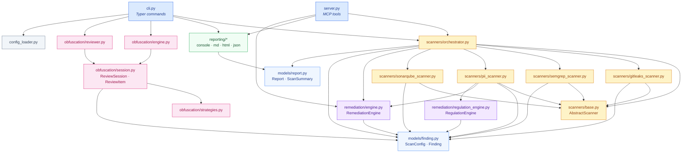
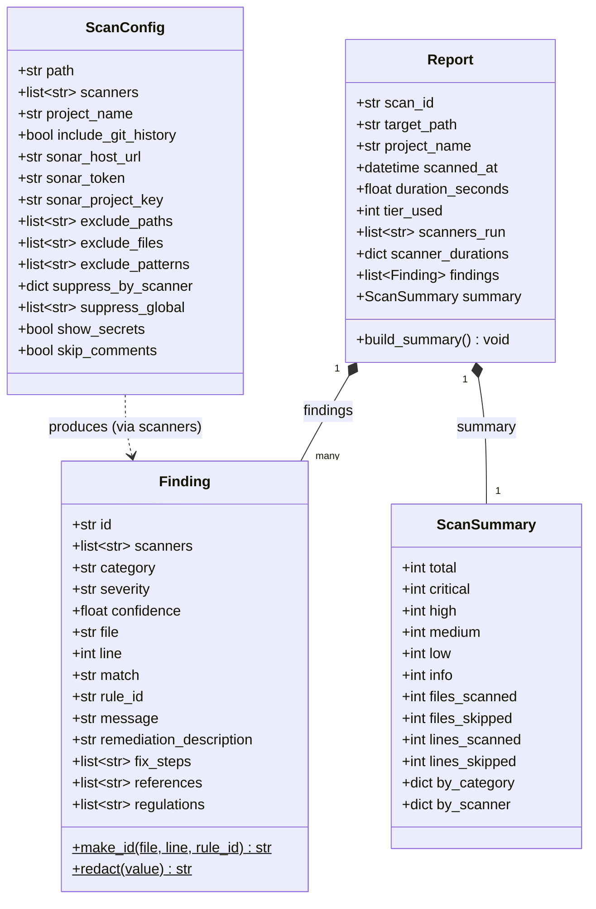
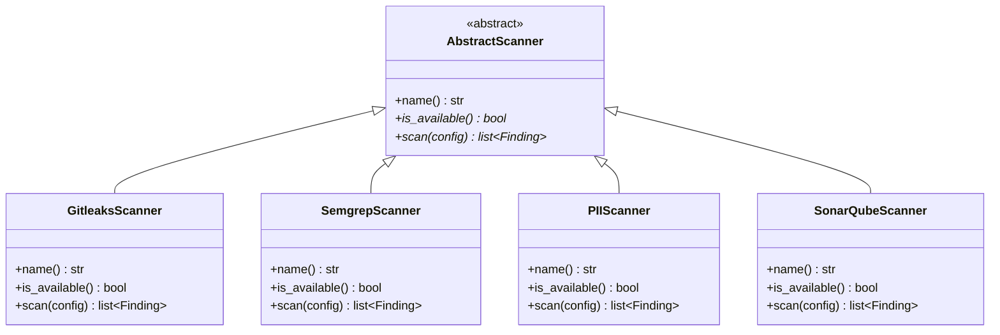
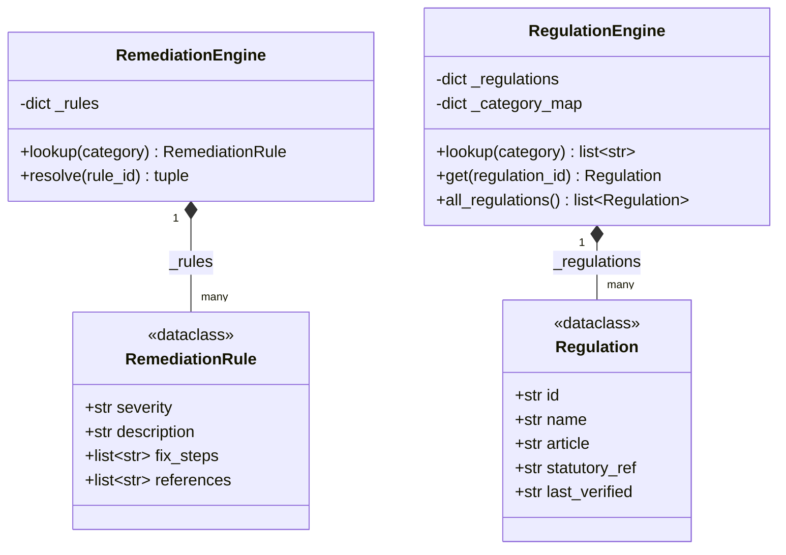
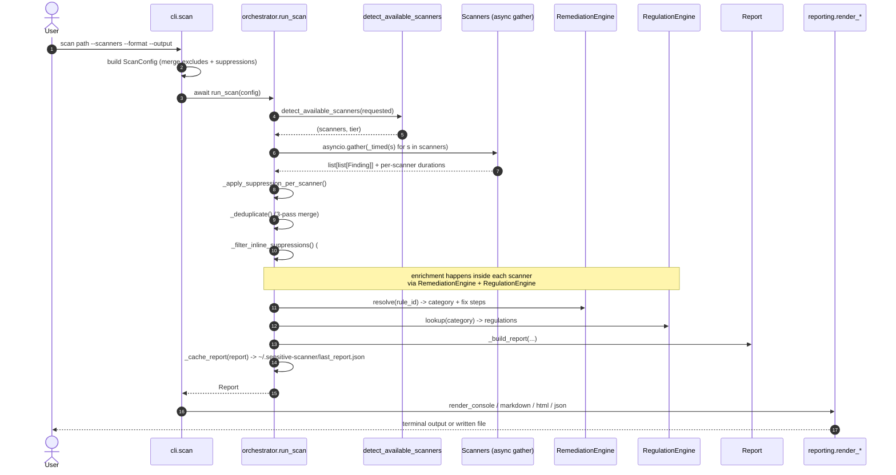
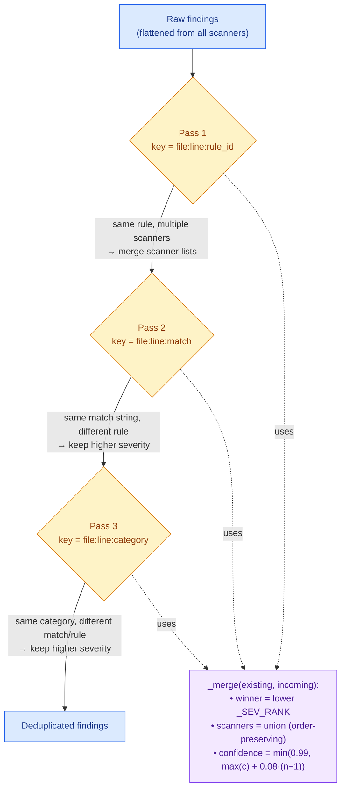
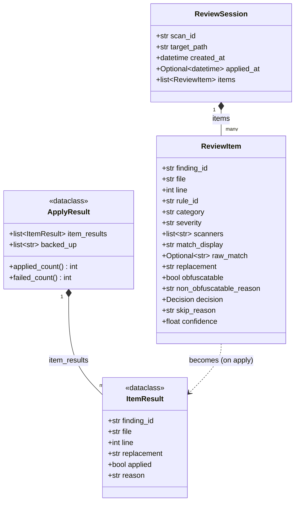
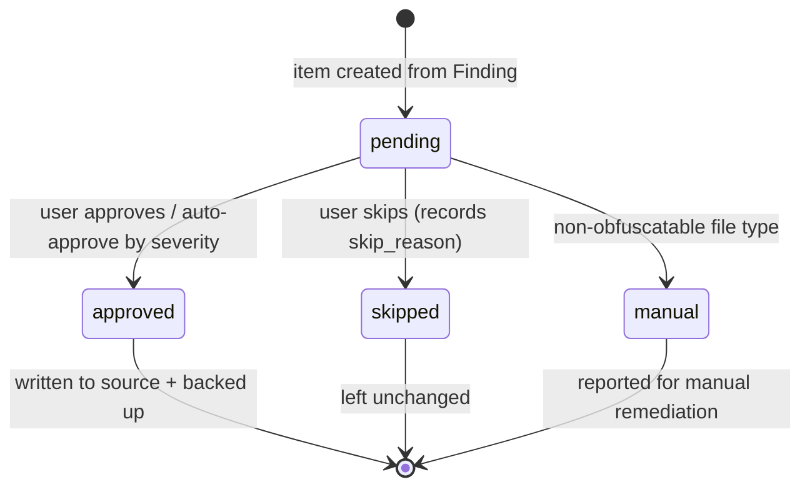
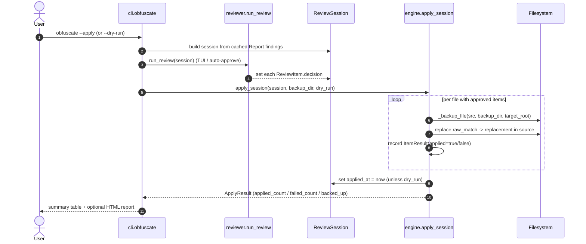
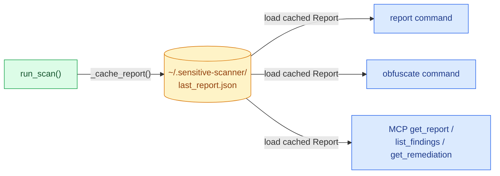

# Low-Level Design — Sensitive Code Screener

> Companion to [HIGH-LEVEL-DESIGN.md](HIGH-LEVEL-DESIGN.md). The HLD covers the
> system shape and component responsibilities; this LLD documents the concrete
> classes, data models, method-level control flow, and lifecycle state used by
> the implementation in `src/`. All diagrams are inline Mermaid so they render
> directly on GitHub and in any Markdown preview.

---

## 1. Scope

This document describes:

- The Pydantic/​dataclass **data models** that flow through the system.
- The **scanner class hierarchy** and the orchestration pipeline.
- The **remediation / regulation enrichment** engines.
- The **obfuscation** review-and-apply subsystem and its decision lifecycle.
- Key **sequence flows** (scan, obfuscate) at the method level.

File paths are given relative to the repository root. Method and field names
match the source exactly so the diagrams can be used for navigation.

---

## 2. Module Dependency Graph

How the Python packages under `src/` depend on one another. Arrows point from a
module to the modules it imports.

---

## 3. Core Data Models

The three Pydantic models that carry scan state. `ScanConfig` is the input,
`Finding` is the unit of output, and `Report` aggregates findings with a
computed `ScanSummary`.

> `Finding.id` is a 16-char SHA-256 of `file:line:rule_id` (`make_id`), which is
> also the deduplication key. `Finding.match` is always stored redacted
> (`redact` keeps the first 4 chars), and `confidence` defaults to `0.70`.
> `ScanConfig.scanners` defaults to `[gitleaks, semgrep, presidio]`.
> `Report.build_summary()` recomputes `ScanSummary` counters from the current
> `findings` list.

---

## 4. Scanner Class Hierarchy

Every scanner implements the same three-member async contract defined by
`AbstractScanner`. The orchestrator holds one singleton instance of each in the
`_ALL_SCANNERS` registry.

> `name` is a property; `is_available()` must never raise and reports whether
> the backend can run in the current environment; `scan()` must never raise —
> on failure it logs and returns `[]`. The fixed `name` values are
> `gitleaks`, `semgrep`, `presidio`, and `sonarqube` respectively — note the PII
> scanner's name is `presidio`, which is also its key in the orchestrator
> registry.

---

## 5. Enrichment Engines

After scanners return raw findings, two engines attach human-readable
remediation guidance and statutory regulation references. Both load their
catalogues from YAML at construction and build in-memory indexes.

> `RemediationEngine.resolve()` maps an arbitrary scanner `rule_id` to one of the
> catalogue category keys using, in order: (1) exact match, (2) substring match,
> (3) the `_KEYWORD_MAP` heuristics, finally falling back to `generic_secret`.
> `RegulationEngine` builds an inverted `category → [regulation_id]` index so a
> PII category resolves to the applicable UK GDPR / PCI DSS / PSR 2017 entries.

---

## 6. Scan Sequence (CLI path)

End-to-end flow of `sensitive-scanner scan <path>` from command invocation to
rendered output. The MCP `scan_codebase` tool follows the same path from
`run_scan` onward.

---

## 7. Deduplication Pipeline

`_deduplicate()` runs three passes, each keyed differently, merging scanner
lists and boosting confidence when multiple engines agree (+8% per extra
scanner, capped at 0.99). The higher-severity finding always wins.

---

## 8. Obfuscation Subsystem

The obfuscate command builds a `ReviewSession` of `ReviewItem`s, lets the user
(or auto-approval) decide each one, then `apply_session` writes redacted
placeholders to source files with full backups for rollback.

> `Decision` is a `Literal["pending", "approved", "skipped", "manual"]`.
> `replacement` comes from `strategies.get_replacement(category)` (e.g.
> `pii_email → [REDACTED_EMAIL]`), defaulting to `[REDACTED]`. Files with
> extensions in `_NON_OBFUSCATABLE_EXTENSIONS` (archives, Office docs, binaries)
> are marked `obfuscatable = false` and forced to the `manual` decision.

---

## 9. Obfuscation Decision Lifecycle

Each `ReviewItem.decision` moves through this state machine. Only `approved`
items are written to disk by `apply_session`.

---

## 10. Obfuscation Apply Sequence

`apply_session` groups items by file, backs up each touched file, performs the
text replacement, then records `applied_at`. `--dry-run` skips all writes but
still produces an `ApplyResult` preview.

---

## 11. Report Cache Lifecycle

A single most-recent report is persisted so subsequent commands
(`report`, `obfuscate`, MCP `get_report`/`list_findings`) can operate without
re-scanning.

---

## 12. Cross-References

| Concern | HLD section | Source |
|---|---|---|
| Component responsibilities | HLD §3–§4 | `src/scanners/orchestrator.py` |
| Suppression hierarchy | HLD §7 | `src/scanners/orchestrator.py`, `config_loader.py` |
| Scanner tiers | HLD §8 | `src/scanners/orchestrator.py` |
| MCP interface | HLD §9 | `src/server.py` |
| Data models | LLD §3 | `src/models/finding.py`, `src/models/report.py` |
| Enrichment | LLD §5 | `src/remediation/engine.py`, `regulation_engine.py` |
| Obfuscation | LLD §8–§10 | `src/obfuscation/*` |
